# Vehicle Detection and Tracking

The goals of this project are the following:

* Perform a Histogram of Oriented Gradients (HOG) feature extraction on a labeled training set of images and train a classifier Linear SVM classifier
* Optionally, you can also apply a color transform and append binned color features, as well as histograms of color, to your HOG feature vector. 
* Implement a sliding-window technique and use your trained classifier to search for vehicles in images.
* Run your pipeline on a video stream and create a heat map of recurring detections frame by frame to reject outliers and follow detected vehicles.
* Estimate a bounding box for vehicles detected.

## Data Exploration

The data of [vehicle](https://s3.amazonaws.com/udacity-sdc/Vehicle_Tracking/vehicles.zip) and [non-vehicle](https://s3.amazonaws.com/udacity-sdc/Vehicle_Tracking/non-vehicles.zip) used to train the classifier for this project comes from a combination of the [GTI vehicle image database](http://www.gti.ssr.upm.es/data/Vehicle_database.html), the [KITTI vision benchmark suite](http://www.cvlibs.net/datasets/kitti/), and examples extracted from the project video itself.

The total amout of images on the dataset is 8792 for vehicles and 8968 for non-vehicle, which represents a good balanced dataset.

In the image bellow is presented sample images for both classes:

<p align="center">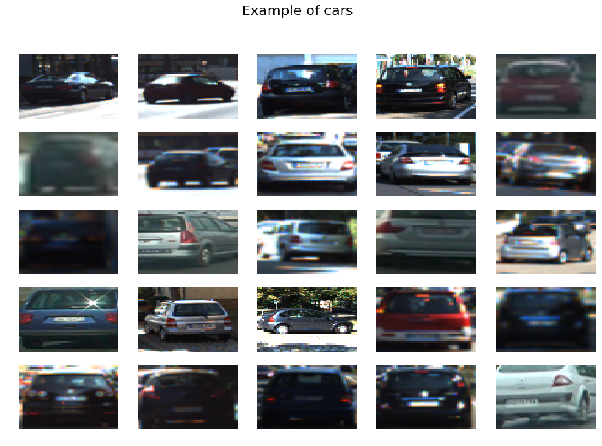</p>

<p align="center">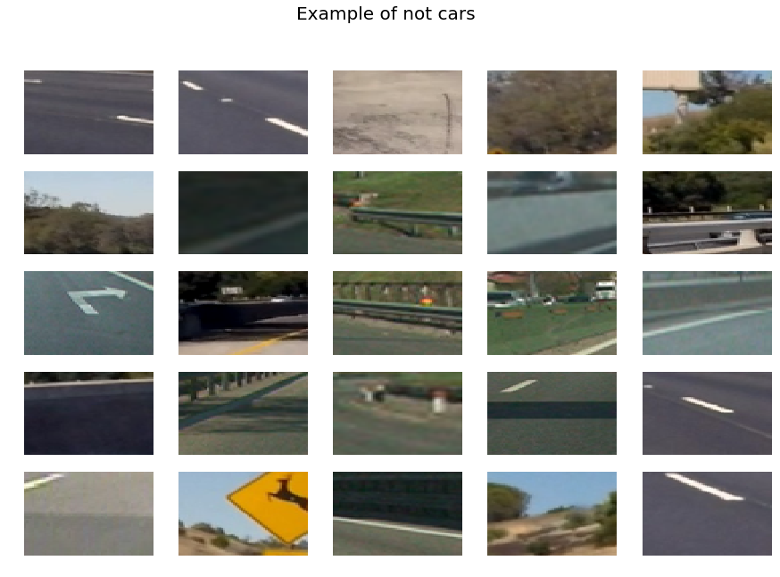</p>

## Features
In order to train the classifier to recognize de difference between vehicle and not vehicle it is necessary to use some features. In this project three features are being used (HOG, color histogram and spatial).

### Histogram of Oriented Gradients (HOG)
One of the features used is the Histogram of Oriented Gradients with the following parameters:

```python
orient = 9  # HOG orientations
pix_per_cell = 8 # HOG pixels per cell
cell_per_block = 2 # HOG cells per block
hog_channel = "ALL" # Can be 0, 1, 2, or "ALL"
```

Bellow is presented HOG features extracted:

<p align="center">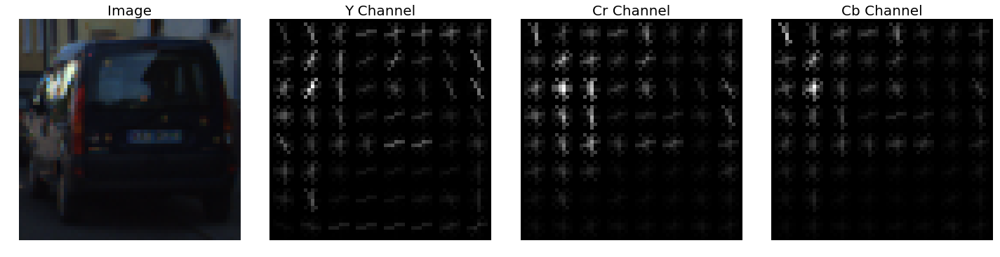</p>
<p align="center">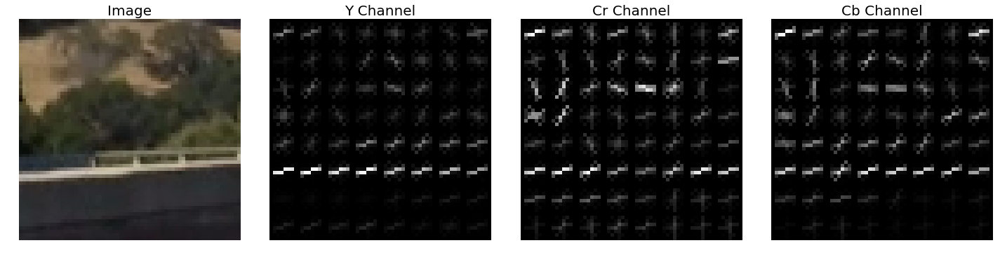</p>

### Color Histogram
In addition to the HOG features, the color histogram was also added to the feature vector.

```python
hist_bins = 32    # Number of histogram bins
```

<p align="center">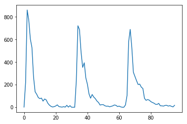</p>

### Spatial Binning of Colors
The last feature extracted from the images is spatial binning of colors with the following parameters:

```python
spatial_size = (32, 32) # Spatial binning dimensions
color_space = 'YCrCb' # Can be RGB, HSV, LUV, HLS, YUV, YCrCb
```

<p align="center">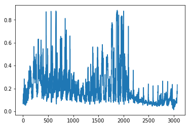</p>

### Scaled Features
After extracting all the features, they are grouped in one single vector to train the classifier, however there is one more step to be done, these features have different values and it needs to be normalized.

Bellow is presented a comparision between raw and normalized features for five different images:

<p align="center"></p>
<p align="center">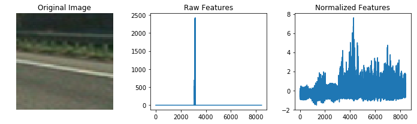</p>
<p align="center">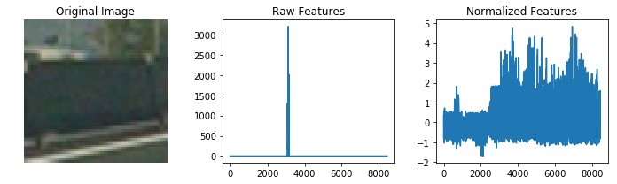</p>
<p align="center">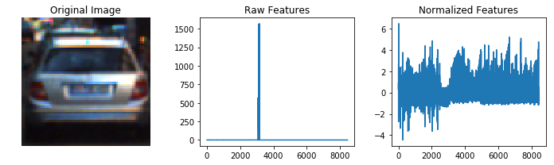</p>
<p align="center">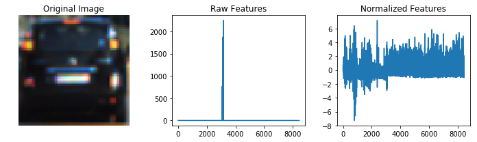</p>

## Classifier
The classifier used for this project is the `LinearSVC` and the result obtained was the following:

```
Using: 9 orientations 8 pixels per cell and 2 cells per block
Feature vector length: 8460
24.93 Seconds to train SVC...
Test Accuracy of SVC =  0.9885
```

## Sliding Window
In order to extract features, a sliding window is implemented. It basically segments the image and analyze piece by piece, saving the positions where it found a vehicle.

In image bellow, the segmentation is illustrated, the concept here is to use small cells for the upper part of the road, where the vehicles are smaller and big cells for the botton part, where vehicles are closer.

```python
x_start_stops = [[None,None],  # red
                 [250, None], # green
                 [400, None]]   # blue
y_start_stops = [[420,650],
                 [400,575],
                 [375,500]]
xy_windows = [(150,150),
              (100,100),
              (60,60)]
xy_overlaps = [(0.8, 0.8),
               (0.8, 0.8),
               (0.8, 0.8)]
```

<p align="center">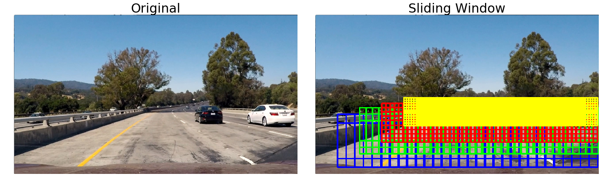</p>

## Find cars and heatmap image
After all functions implemented, it is possible to get an image as input, extract the features using the sliding window, classify it with the trained classifier and plot the boxes where the classifier identified as vehicle.

<p align="center"></p>

In order to remove false positives, a heatmap is created and a threshold aplied, resulting the image bellow.

<p align="center">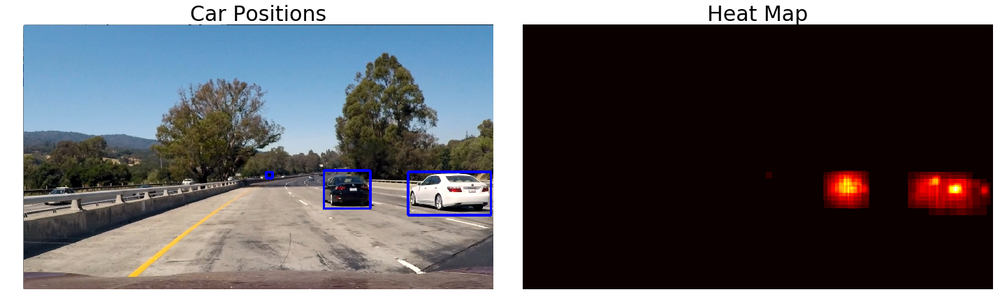</p>

## Results
This project was much more simpler to implement because Udacity provided a lot of examples, so the hard work was to tune the parameters and try different things.

Bellow is presented a video containing the output result for the given video.

<p align="center">[](https://youtu.be/u_IQnYZBrWA)

## Discussion
The algorithm was tested in the video provided by Udacity, and a good result was obtained. However it fails for some frames.

In order to improve the results I would train it with more examples of vehicles and not-vehicles, as well as extracted more features from the images.

Another thing that I still have to improve is to not recalculate the HOG features for each window and just cut the portion that I need from the HOG features calculated for the whole image.